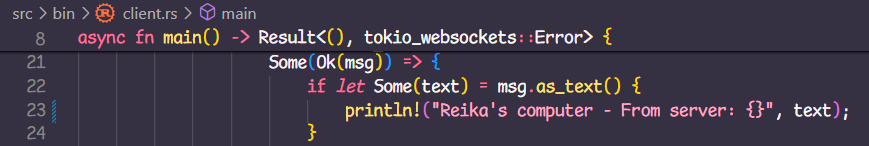

### 2.1 Original code, and how it run

We can run it by opening a terminal and typing <code>cargo run --bin server</code> to run the server, and open 3 different terminals and type <code>cargo run --bin client</code> in each of them to run 3 different instances of the client. Then, we can just type our message in each client terminal. Afterwards, it'll look like this:

Terminal of client #1:

Terminal of client #2:

Terminal of client #3:

Terminal of server:

You can type a message in a client and then the server will broadcast it for all of the clients to see.

### 2.2 Modifying port

Since it's a connection, it has two sides, which means that if we wanted to modify the port the client is connected to (from 2000 to 8080) we would have to change the server's listener port from 2000 to 8080 as well on server.rs line 43. Otherwise, they won't be connected to the same port, and the client side will encounter an error. On the other hand, the server side would be waiting a connection on its unchanged 2000 port.

After being run successfully by changing the ports on both server and client to 8080:

Terminal of server:

Terminal of client #1:

Terminal of client #2:

Terminal of client #3:

### 2.3 Small changes, add IP and Port

Modification for server.rs:

Modification for client.rs:

After modifying the code in client.rs and server.rs to add IP and port information, this is the result:

Terminal of server:

Terminal of client #1:

Terminal of client #2:

Terminal of client #3:

